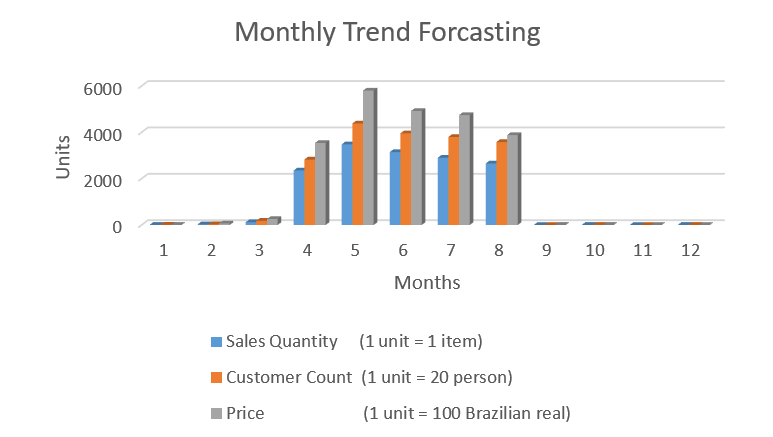

# Ecommerce Sales Data Analysis

### 19AIE214-Big Data Analysis Project
<u>Authors:</u>  
Dharshan Kumar K S  
Siva Prakash

 

## Data
Data consists of Ecommerce data from 04-09-2016 to 03-09-2018, which is about 2 years of data. The dataset we have used is a combination of 9 sub-datasets which originally is 120.3 MB sized dataset. But we have pre-processed and removed many unwanted feature columns and used the modified dataset for our project analysis. 
Dataset rows    : 1,16,573  
Dataset columns : 21  
Dataset size    : 27.4 MB  
Dataset link    : https://amritavishwavidyapeetham-my.sharepoint.com/:x:/g/personal/cb_en_u4aie19024_cb_students_amrita_edu/EXutaLENebZGmRHiBsClRXMBaE4T7Cz7SHNdObgyzI8oGg?e=IY32cT  
Original Dataset link : https://www.kaggle.com/olistbr/brazilian-ecommerce  

 

## Data Description
| S.No |	Name |	Description |
|-------|------|--------------|
|1  |order_id	|unique id for each order (32 fixed-size number)
|2	|customer_id	|unique id for each customer (32 fixed-size number)
|3	|quantity	|1-21
|4	|price_MRP	|cost price, 0.85-6735 
|5	|payment	|selling price, 0-13664.8
|6	|timestamp	|order purchase time (local, day-month-year hour:min:sec AM/PM)
|7	|rating	|1-5
|8	|product_category	|category under which product belongs
|9	|product_id	|unique id for each product (32 fixed-size number)
|10	|payment_type	|Type of payment - credit card/debit card/boleto/voucher
|11	|order_status	|delivered/shipped/invoiced
|12	|product_weight_g	|weight of product (in grams), 0-40425
|13	|product_length_cm	|length of product (in centimeter), 7-105
|14	|product_height_cm	|height of product (in centimeter), 2-105
|15	|product_width_cm	|width of product (in centimeter), 6-118
|16	|customer_city	|city where order is placed
|17	|customer_state	|state where order is placed
|18	|seller_id |unique id for each seller (32 fixed-size number)
|19	|seller_city	|city where order is picked up
|20	|seller_state	|state where order is picked up
|21	|payment_installments	|no. of installments taken by customer to pay bill, 0-24

 

## Analysis Performed using Spark

1. <b>Customer Segmentation</b> Categorizing customers based on their spendings 
   [Bar-graph]

2. <b>Monthly Trend Forecasting</b> Visualising the monthly trend of sales 
   [Bar-graph]

3. <b>Hourly Sales Analysis</b> Which hour has more no. of sales? 
   [Timeseries-Plot]

4. <b>Product Based Analysis</b> 
   Which category product has sold more? 
   Which category product has more rating? 
   Which product has sold more? 
   Top 10 highest & least product rating? 
   Order Count for each rating 
   [Bar-graph]

5. <b>Payment Preference</b> 
   What are the most commonly used payment types? 
   Count of Orders With each No. of Payment Installments 
   [Pie-Chart]

6. <b>Potential Customer's Location</b> 
   Where do most customers come from? 
   [Pie-chart]

7. <b>Seller Rating</b> 
   Which seller sold more? 
   Which seller got more rating? 
   [Bar-graph]

8. <b>Logistics based Optimization Insights</b> 
   Which city buys heavy weight products and low weight products? 
   [Pie-chart] 
   How much products sold within seller state? 
   [Bar-graph]

#### Machine Learning Model:

9. <b>Predicting future sales</b> 
   ML - Linear regression

#### Visualization:

Total no. of Graphs & Plots: 19 
Python Plots 
Excel Plots

 

## Example Plot
 

  

